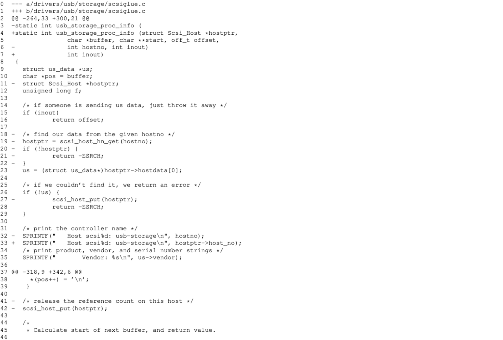

# Semantic Patches

## Introduction

We propose a **scripting language** which offers a WYSIWYG, What You See Is What You Get, approach to **program transformation**. In the spirit of Linux development practice, this language is based on the patch syntax. As opposed to traditional patches, our patches are not line-oriented but **semantics-oriented**, and hence we give them the name *semantic patches*.

This paper gives a tutorial on our semantic patch language, SmPL, and its associated transformation tool, spatch. We first give an idea of the kind of program transformations we target, collateral evolutions, and then present SmPL using an example based on Linux driver code. Finally, we describe the current status of our project and propose some future work.

## Evolutions and Collateral Evolutions

The evolutions we consider are those that affect a library API. Elements of a library API that can be affected include **functions, global variables and constants, types, and macros**.

Many kinds of changes in the API can result from an evolution that affect one of these elements. For example, functions or macros can change name or gain or lose arguments. Structure types can be reorganized and accesses to them can be encapsulated in getter and setter functions. The protocol for using a sequence of functions, such as up and down can change, as can the protocol for when error checking is needed and what kind of error values should be returned.

Each of these changes requires corresponding collateral evolutions, in all drivers using the API. Thus, these changes have to be mapped onto the structure of each affected driver file.

## Semantic Patch Tutorial

### The “proc_info” evolution

As an example, we consider an evolution and associated collateral evolutions affecting the SCSI API functions `scsi_host_hn_get` and `scsi_host_put`. These functions access and release, respectively, a structure of type `Scsi_Host`, and additionally increment and decrement, respectively, a reference count. In Linux 2.5.71, it was decided that, due to the criticality of the reference count, driver code could not be trusted to use these functions correctly and they were removed from the SCSI API.



This evolution had collateral effects on the “proc_info” callback functions defined by SCSI drivers, which call these API functions. The code above shows a slightly simplified excerpt of the traditional patch file. Similar collateral evolutions were performed in Linux 2.5.71 in 18 other SCSI driver files inside the kernel source tree.

### A semantic patch, step by step

We now describe the semantic patch that will perform the previous collateral evolutions, on any of the 19 relevant files inside the kernel source tree, and on any relevant drivers outside the kernel source tree. We first describe step-by-step various excerpts of this semantic patch, and then present its complete definition later.

#### Modifiers

The first excerpt adds and removes the affected parameters of the proc_info callback function:

```C
 proc_info_func (
+     struct Scsi_Host *hostptr,
      char *buffer, char **start, off_t offset,
-     int hostno,
      int inout) { ... }
```

Like a traditional patch, a semantic patch consists of a sequence of lines, some of which begin with the *modifiers* `+` and `-` in the first column. These lines are added or removed, respectively. The remaining lines serve as *context*, to more precisely identify the code that should be modified.

**Unlike a traditional patch, a semantic patch must have the form of a complete C-language term (an expression, a statement, a function definition, etc.).** Here we are modifying a function, so the semantic patch has the form of a function definition. Because our only goal at this point is to modify the parameter list, we do not care about the function body. Thus, we have represented it with “...”.

**Another difference as compared to a traditional patch is that the meaning of a semantic patch is insensitive to newlines, spaces, comments, etc.**

To apply a semantic patch, it should be stored in a file, *e.g.*, `procinfo.spatch`. It can then be applied to *e.g.* the set of C files in the current directory using our spatch tool:

```shell
spatch *.c < procinfo.spatch
```

#### Metavariables

SmPL provides *metavariables* which is a variable that matches an arbitrary term in the driver source code. Metavariables are declared before the patch code specifying the transformation, between `@@`, borrowing the notation for delimiting line numbers in a traditional patch (Figure above, lines 2 and 37). **Metavariables are designated as matching terms of a specific kind, such as an identifier, expression, or statement, or terms of a specific type, such as `int` or `off_t`. We call the combination of the declaration of a set of metavariables and a transformation specification a *rule*.**

Back to our running example, the previous excerpt is made into a rule as follows:

```C
@@
identifier proc_info_func;
identifier buffer, start, offset, inout, hostno;
identifier hostptr;
@@
 proc_info_func (
+        struct Scsi_Host *hostptr,
         char *buffer, char **start, off_t offset,
-        int hostno,
         int inout) { ... }
```

This code now amounts to a complete, valid semantic patch, although it still only performs part of our desired collateral evolution.

#### Multiple rules and inherited metavariables

**SmPL allows a semantic patch to define multiple rules, just as a traditional patch contains multiple regions separated by `@@`.** The rules are applied in sequence, with each of them being applied to the entire source code of the driver. In our example we thus define one rule to identify the name of the callback function and another to transform its definition, as follows:

```C
@ rule1 @
struct SHT ops;
identifier proc_info_func;
@@
  ops.proc_info = proc_info_func;

@ rule2 @
identifier rule1.proc_info_func;
identifier buffer, start, offset, inout, hostno;
identifier hostptr;
@@
  proc_info_func (
+        struct Scsi_Host *hostptr,
         char *buffer, char **start, off_t offset,
-        int hostno,
         int inout) { ... }
```

In the new semantic patch, the metavariable `proc_info_func` is defined in the first rule and referenced in the second rule, where we expect it to have the same value, which is enforced by spatch. In general, a rule may declare new metavariables and *inherit* metavariables from previous rules. Inheritance is explicit, in that the inherited metavariable must be declared again in the inheriting rule, and is associated with the name of the rule from which its value should be inherited (the rule name is only used in the metavariable declaration, but not in the transformation specification, which retains the form of ordinary C code). To allow this kind of inheritance, we must have means of naming rules. As shown in the semantic patch above, the name of a rule is placed between `@@` at the beginning of a metavariable declaration. A name is optional, and is not needed if the rule does not export any metavariables.

Note that the first rule does not perform any transformations. Instead, its only role is to bind the `proc_info_func` metavariable to constrain the matching of the second rule. Once a metavariable obtains a value it keeps this value until the end of the current rule and in any subsequent rules that inherit it.

A metavariable may take on multiple values, if the rule matches at multiple places in the driver code. If such a metavariable is inherited, the inheriting rule is applied once for each possible set of bindings of the metavariables it inherits.
