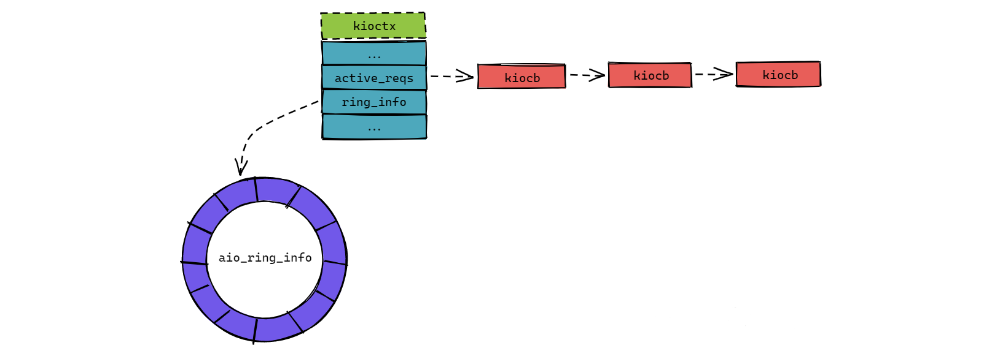

# Linux Native AIO

`Linux Native AIO`是Linux支持的原生AIO，为什么要加原生这个词呢？因为Linux存在很多第三方的异步IO库，如`libeio`和`glibc AIO`。所以为了加以区别，Linux的内核提供的异步IO就称为原生异步IO。

很多第三方的异步IO库都不是真正的异步IO，而是使用多线程来模拟异步IO，如`libeio`就是使用多线程来模拟异步IO的。

## Linux Native AIO的使用

Linux原生AIO处理流程：

- 当应用程序调用`io_submit`系统调用发起一个异步IO操作后，会向内核的IO任务队列中添加一个IO任务，并且返回成功；
- 内核会在后台处理IO任务队列中的IO任务，然后把处理结果存储在IO任务中；
- 应用程序可以调用`io_getevents`系统调用来获取异步IO的处理结果，如果IO操作还没完成，那么返回失败信息，否则会返回IO处理结果；

从上面的流程可以看出，Linux 的异步IO操作主要由两个步骤组成：

- 调用`io_submit`函数发起一个异步IO操作；
- 调用`io_getevents`函数获取异步IO的结果；

```C
#define _GNU_SOURCE

#include <stdlib.h>
#include <string.h>
#include <libaio.h>
#include <errno.h>
#include <stdio.h>
#include <unistd.h>
#include <fcntl.h>

#define FILEPATH "./aio.txt"

int main()
{
        io_context_t context;
        struct iocb io[1], *p[1] = {&io[0]};
        struct io_event e[1];
        unsigned nr_events = 10;
        struct timespec timeout;
        char *wbuf;
        int wbuflen = 1024;
        int ret, num = 0, i;

        posix_memalign((void **)&wbuf, 512, wbuflen);

        memset(wbuf, '@', wbuflen);
        memset(&context, 0, sizeof(io_context_t));

        timeout.tv_sec = 0;
        timeout.tv_nsec = 10000000;

        // 1. 打开要进行异步IO的文件
        int fd = open(FILEPATH, O_CREAT|O_RDWR|O_DIRECT, 0644);
        if (fd < 0) {
                printf("open error: %d\n", errno);
                return 0;
        }

        // 2. 创建一个异步IO上下文
        if (0 != io_setup(nr_events, &context)) {
                printf("io_setup error: %d\n", errno);
                return 0;
        }

        // 3. 创建一个异步IO任务
        io_prep_pwrite(&io[0], fd, wbuf, wbuflen, 0);

        // 4. 提交异步IO任务
        if ((ret = io_submit(context, 1, p)) != 1) {
                printf("io_submit error: %d\n", ret);
                io_destroy(context);
                return -1;
        }

        while (1) {
                // 5. 获取异步IO的结果
                ret = io_getevents(context, 1, 1, e, &timeout);
                if (ret < 0) {
                        printf("io_getevents error: %d\n", ret);
                        break;
                }

                if (ret > 0) {
                        printf("result, res2: %d, res: %d\n", e[0].res2, e[0].res);
                        break;
                }
        }

        return 0;
}
```

在上面的例子中，我们获取异步IO操作的结果是在一个无限循环中进行的，其实 Linux 还支持一种基于`eventfd`事件通知的机制，可以通过`eventfd`和`epoll`结合来实现事件驱动的方式来获取异步IO操作的结果。

## Linux Native AIO的实现

Linux原生AIO实现在源码文件`/fs/aio.c`中。

### 基本数据结构

在内核中，异步IO上下文使用`kioctx`结构表示，定义如下：

```C
struct kioctx {
        atomic_t                users;    // 引用计数器
        int                     dead;     // 是否已经关闭
        struct mm_struct        *mm;      // 对应的内存管理对象

        unsigned long           user_id;  // 唯一的ID，用于标识当前上下文, 返回给用户
        struct kioctx           *next;

        wait_queue_head_t       wait;     // 等待队列
        spinlock_t              ctx_lock; // 锁

        int                     reqs_active; // 正在进行的异步IO请求数
        struct list_head        active_reqs; // 正在进行的异步IO请求对象
        struct list_head        run_list;

        unsigned                max_reqs;  // 最大IO请求数

        struct aio_ring_info    ring_info; // 环形缓冲区

        struct work_struct      wq;
};
```

在`kioctx`结构中，比较重要的成员为`active_reqs`和`ring_info`。`active_reqs`保存了所有正在进行的异步IO操作，而`ring_info`成员用于存放异步IO操作的结果。



如图所示，`active_reqs`成员保存的异步IO操作队列是以`kiocb`结构为单元的，而`ring_info`成员指向一个类型为`aio_ring_info`结构的环形缓冲区（Ring Buffer）。

```C
struct kiocb {
        ...
        struct file             *ki_filp;      // 异步IO操作的文件对象
        struct kioctx           *ki_ctx;       // 指向所属的异步IO上下文
        ...
        struct list_head        ki_list;       // 用于连接所有正在进行的异步IO操作对象
        __u64                   ki_user_data;  // 用户提供的数据指针(可用于区分异步IO操作)
        loff_t                  ki_pos;        // 异步IO操作的文件偏移量
        ...
};

...

struct aio_ring_info {
        unsigned long           mmap_base;     // 环形缓冲区的虚拟内存地址
        unsigned long           mmap_size;     // 环形缓冲区的大小

        struct page             **ring_pages;  // 环形缓冲区所使用的内存页数组
        spinlock_t              ring_lock;     // 保护环形缓冲区的自旋锁
        long                    nr_pages;      // 环形缓冲区所占用的内存页数

        unsigned                nr, tail;

        // 如果环形缓冲区不大于 8 个内存页时
        // ring_pages 就指向 internal_pages 字段
#define AIO_RING_PAGES  8
        struct page             *internal_pages[AIO_RING_PAGES]; 
};
```

环形缓冲区的`head`和`tail`位置保存在`aio_ring`的结构中，其定义如下：

```C
struct aio_ring {
        unsigned                id;
        unsigned                nr;    // 环形缓冲区可容纳的 io_event 数
        unsigned                head;  // 环形缓冲区的开始位置
        unsigned                tail;  // 环形缓冲区的结束位置
        ...
};
```

### 创建异步IO上下文

异步IO上下文的创建通过调用`io_setup`函数完成，而`io_setup`函数会调用内核函数`sys_io_setup`，其实现如下：

```C
asmlinkage long sys_io_setup(unsigned nr_events, aio_context_t *ctxp)
{
        struct kioctx *ioctx = NULL;
        unsigned long ctx;
        long ret;
        ...
        ioctx = ioctx_alloc(nr_events);  // 调用 ioctx_alloc 函数创建异步IO上下文
        ret = PTR_ERR(ioctx);
        if (!IS_ERR(ioctx)) {
                ret = put_user(ioctx->user_id, ctxp); // 把异步IO上下文的标识符返回给调用者
                if (!ret)
                        return 0;
                io_destroy(ioctx);
        }
out:
        return ret;
}
```

`sys_io_setup`函数的实现比较简单，首先调用`ioctx_alloc`申请一个异步IO上下文对象，然后把异步IO上下文对象的标识符返回给调用者。所以，`sys_io_setup`函数的核心过程是调用`ioctx_alloc`函数，我们继续分析`ioctx_alloc`函数的实现：

```C
static struct kioctx *ioctx_alloc(unsigned nr_events)
{
        struct mm_struct *mm;
        struct kioctx *ctx;
        ...
        ctx = kmem_cache_alloc(kioctx_cachep, GFP_KERNEL); // 申请一个 kioctx 对象
        ...
        INIT_LIST_HEAD(&ctx->active_reqs);                 // 初始化异步 IO 操作队列
        ...
        if (aio_setup_ring(ctx) < 0)                       // 初始化环形缓冲区
                goto out_freectx;
        ...
        return ctx;
        ...
}
```

`ioctx_alloc`函数主要完成以下工作：

- 调用`kmem_cache_alloc`函数向内核申请一个异步IO上下文对象；
- 初始化异步IO上下文各个成员变量，如初始化异步IO操作队列；
- 调用`aio_setup_ring`函数初始化环形缓冲区。

### 提交异步IO操作

提交异步IO操作是通过`io_submit`函数完成的，`io_submit`需要提供一个类型为`iocb`结构的数组，表示要进行的异步IO操作相关的信息，我们先来看看`iocb`结构的定义：

```C
struct iocb {
        __u64   aio_data;       // 用户自定义数据, 可用于标识IO操作或者设置回调函数
        ...
        __u16   aio_lio_opcode; // IO操作类型, 如读(IOCB_CMD_PREAD)或者写(IOCB_CMD_PWRITE)操作
        __s16   aio_reqprio;
        __u32   aio_fildes;     // 进行IO操作的文件句柄
        __u64   aio_buf;        // 进行IO操作的缓冲区(如写操作的话就是写到文件的数据)
        __u64   aio_nbytes;     // 缓冲区的大小
        __s64   aio_offset;     // IO操作的文件偏移量
        ...
};
```

`io_submit`函数最终会调用内核函数`sys_io_submit`来实现提供异步IO操作，我们来分析`sys_io_submit`函数的实现：

```C
asmlinkage long sys_io_submit(aio_context_t ctx_id, long nr, struct iocb __user **iocbpp)
{
        struct kioctx *ctx;
        long ret = 0;
        int i;
        ...
        ctx = lookup_ioctx(ctx_id); // 通过异步IO上下文标识符获取异步IO上下文对象
        ...
        for (i = 0; i < nr; i++) {
                struct iocb __user *user_iocb;
                struct iocb tmp;

                if (unlikely(__get_user(user_iocb, iocbpp+i))) {
                        ret = -EFAULT;
                        break;
                }

                // 从用户空间复制异步IO操作到内核空间
                if (unlikely(copy_from_user(&tmp, user_iocb, sizeof(tmp)))) {
                        ret = -EFAULT;
                        break;
                }

                // 调用 io_submit_one 函数提交异步IO操作
                ret = io_submit_one(ctx, user_iocb, &tmp);
                if (ret)
                        break;
        }

        put_ioctx(ctx);
        return i ? i : ret;
}
```

`sys_io_submit`函数的实现比较简单，主要从用户空间复制异步IO操作信息到内核空间，然后调用io_submit_one函数提交异步 IO操作：

```C
int io_submit_one(struct kioctx *ctx, struct iocb __user *user_iocb, struct iocb *iocb)
{
        struct kiocb *req;
        struct file *file;
        ssize_t ret;
        char *buf;
        ...
        file = fget(iocb->aio_fildes);      // 通过文件句柄获取文件对象
        ...
        req = aio_get_req(ctx);             // 获取一个异步IO操作对象
        ...
        req->ki_filp = file;                // 要进行异步IO的文件对象
        req->ki_user_obj = user_iocb;       // 指向用户空间的iocb对象
        req->ki_user_data = iocb->aio_data; // 设置用户自定义数据
        req->ki_pos = iocb->aio_offset;     // 设置异步IO操作的文件偏移量

        buf = (char *)(unsigned long)iocb->aio_buf; // 要进行异步IO操作的数据缓冲区

        // 根据不同的异步IO操作类型来进行不同的处理
        switch (iocb->aio_lio_opcode) {
                case IOCB_CMD_PREAD: // 异步读操作
                ...
                ret = -EINVAL;
                // 发起异步IO操作, 会根据不同的文件系统调用不同的函数:
                // 如ext3文件系统会调用 generic_file_aio_read 函数
                if (file->f_op->aio_read)
                        ret = file->f_op->aio_read(req, buf, iocb->aio_nbytes, req->ki_pos);
                break;
                ...
        }
        ...
        // 异步IO操作或许会在调用 aio_read 时已经完成, 或者会被添加到IO请求队列中。
        // 所以, 如果异步IO操作被提交到IO请求队列中, 直接返回
        if (likely(-EIOCBQUEUED == ret)) return 0;

        aio_complete(req, ret, 0); // 如果IO操作已经完成, 调用 aio_complete 函数完成收尾工作
        return 0;
}
```

`io_submit_one`函数主要完成的工作：

- 通过调用`fget`函数获取文件句柄对应的文件对象；
- 调用`aio_get_req`函数获取一个类型为`kiocb`结构的异步IO操作对象，这个结构前面已经分析过。另外，`aio_get_req`函数还会把异步IO操作对象添加到异步IO上下文的`active_reqs`队列中；
- 根据不同的异步IO操作类型来进行不同的处理，如`异步读操作`会调用文件对象的`aio_read`方法来进行处理。不同的文件系统，其`aio_read`方法的实现不一样，如Ext3文件系统的`aio_read`方法会指向`generic_file_aio_read`函数；
- 如果异步IO操作被添加到内核的IO请求队列中，那么就直接返回。否则就代表IO操作已经完成，那么就调用`aio_complete`函数完成收尾工作。

### 异步IO操作完成

当异步IO操作完成后，内核会调用`aio_complete`函数来把处理结果放进异步IO上下文的环形缓冲区`ring_info中，我们来分析一下`aio_complete`函数的实现：

```C
int aio_complete(struct kiocb *iocb, long res, long res2)
{
        struct kioctx *ctx = iocb->ki_ctx;
        struct aio_ring_info *info;
        struct aio_ring *ring;
        struct io_event *event;
        unsigned long flags;
        unsigned long tail;
        int ret;
        ...
        info = &ctx->ring_info; // 环形缓冲区对象

        spin_lock_irqsave(&ctx->ctx_lock, flags);         // 对异步IO上下文进行上锁
        ring = kmap_atomic(info->ring_pages[0], KM_IRQ1); // 对内存页进行虚拟内存地址映射

        tail = info->tail;                           // 环形缓冲区下一个空闲的位置
        event = aio_ring_event(info, tail, KM_IRQ0); // 从环形缓冲区获取空闲的位置保存结果
        tail = (tail + 1) % info->nr;                // 更新下一个空闲的位置

        // 保存异步IO结果到环形缓冲区中
        event->obj = (u64)(unsigned long)iocb->ki_user_obj;
        event->data = iocb->ki_user_data;
        event->res = res;
        event->res2 = res2;
        ...
        info->tail = tail;
        ring->tail = tail; // 更新环形缓冲区下一个空闲的位置

        put_aio_ring_event(event, KM_IRQ0); // 解除虚拟内存地址映射
        kunmap_atomic(ring, KM_IRQ1);       // 解除虚拟内存地址映射

        // 释放异步IO对象
        ret = __aio_put_req(ctx, iocb);
        spin_unlock_irqrestore(&ctx->ctx_lock, flags);
        ...
        return ret;
}
```

`aio_complete`函数的`iocb`参数是我们通过调用`io_submit_once`函数提交的异步`IO`对象，而参数`res`和`res2`是用内核进行IO操作完成后返回的结果。

`aio_complete`函数的主要工作如下：

- 根据环形缓冲区的`tail`指针获取一个空闲的`io_event`对象来保存IO操作的结果；
- 对环形缓冲区的 tail 指针进行加一操作，指向下一个空闲的位置。

当把异步IO操作的结果保存到环形缓冲区后，用户层就可以通过调用`io_getevents`函数来读取IO操作的结果，`io_getevents`函数最终会调用`sys_io_getevents`函数：

```C
asmlinkage long sys_io_getevents(aio_context_t ctx_id, long min_nr, long nr,
                                 struct io_event *events, struct timespec *timeout)
{
        struct kioctx *ioctx = lookup_ioctx(ctx_id);
        long ret = -EINVAL;
        ...
        if (likely(NULL != ioctx)) {
                // 调用 read_events 函数读取IO操作的结果
                ret = read_events(ioctx, min_nr, nr, events, timeout);
                put_ioctx(ioctx);
        }
        return ret;
}
```

```C
static int read_events(struct kioctx *ctx, long min_nr, long nr,
                      struct io_event *event, struct timespec *timeout)
{
        long start_jiffies = jiffies;
        struct task_struct *tsk = current;
        DECLARE_WAITQUEUE(wait, tsk);
        int ret;
        int i = 0;
        struct io_event ent;
        struct timeout to;

        memset(&ent, 0, sizeof(ent));
        ret = 0;

        while (likely(i < nr)) {
                ret = aio_read_evt(ctx, &ent); // 从环形缓冲区中读取一个IO处理结果
                if (unlikely(ret <= 0))        // 如果环形缓冲区没有IO处理结果, 退出循环
                        break;

                ret = -EFAULT;
                // 把IO处理结果复制到用户空间
                if (unlikely(copy_to_user(event, &ent, sizeof(ent)))) {
                        break;
                }

                ret = 0;
                event++;
                i++;
        }

        if (min_nr <= i)
                return i;
        if (ret)
                return ret;
        ...
}
```

```C
static int aio_read_evt(struct kioctx *ioctx, struct io_event *ent)
{
        struct aio_ring_info *info = &ioctx->ring_info;
        struct aio_ring *ring;
        unsigned long head;
        int ret = 0;

        ring = kmap_atomic(info->ring_pages[0], KM_USER0);

        // 如果环形缓冲区的head指针与tail指针相等, 代表环形缓冲区为空, 所以直接返回
        if (ring->head == ring->tail) 
                goto out;

        spin_lock(&info->ring_lock);

        head = ring->head % info->nr;
        if (head != ring->tail) {
                // 根据环形缓冲区的head指针从环形缓冲区中读取结果
                struct io_event *evp = aio_ring_event(info, head, KM_USER1);

                *ent = *evp;                  // 将结果保存到ent参数中
                head = (head + 1) % info->nr; // 移动环形缓冲区的head指针到下一个位置
                ring->head = head;            // 保存环形缓冲区的head指针
                ret = 1;
                put_aio_ring_event(evp, KM_USER1);
        }

        spin_unlock(&info->ring_lock);

out:
        kunmap_atomic(ring, KM_USER0);
        return ret;
}
```

