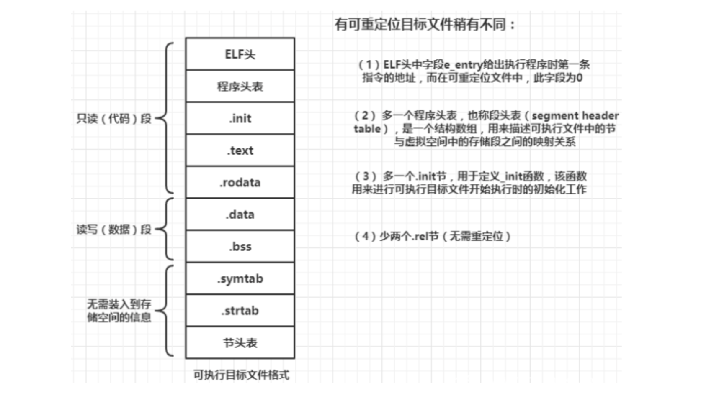
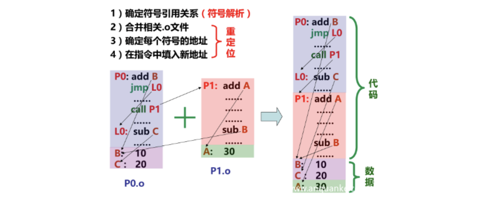
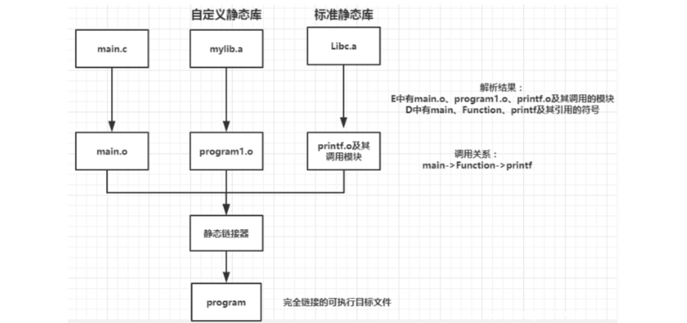
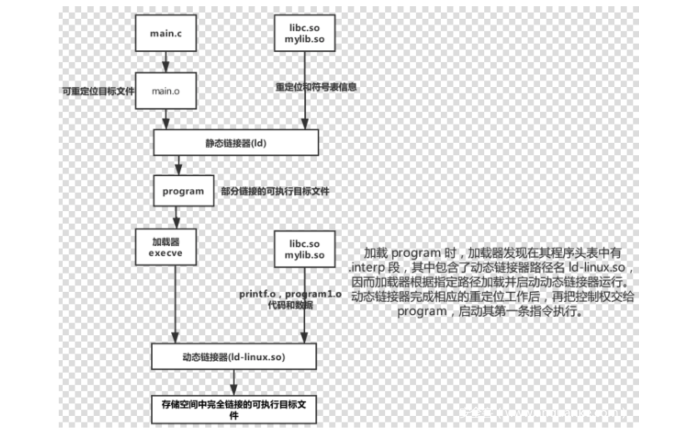
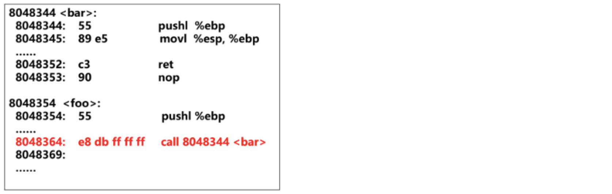
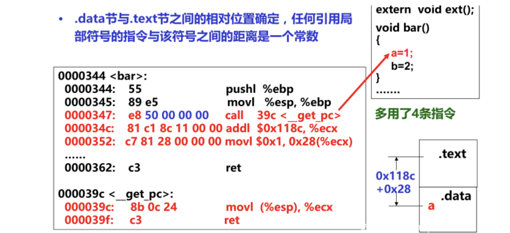
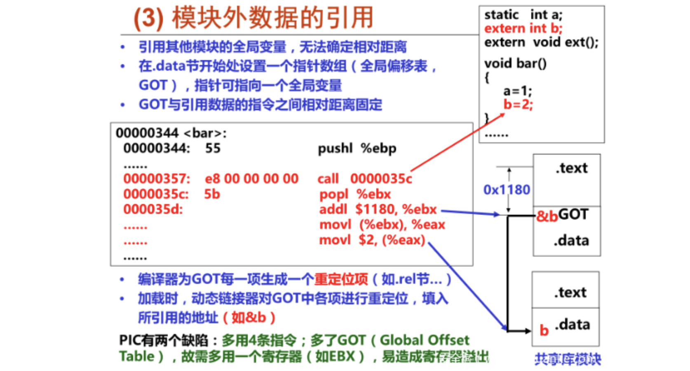
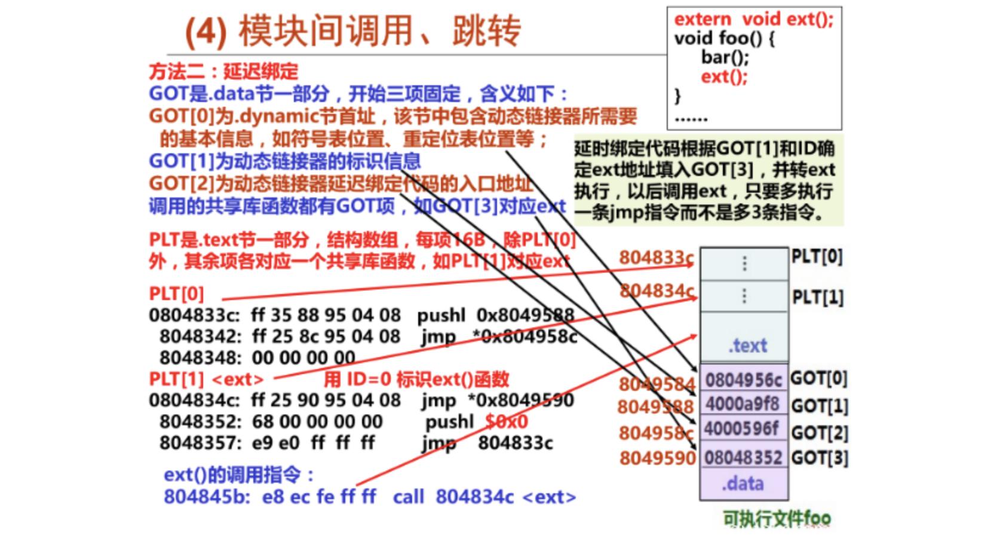

# Global Offset Table

## ELF文件生成过程

```C
// gcc hello.c -o hello

// hello.c
#include <stdio.h>
int main(){
    printf("Hello World!n");
    return 0;
}
```

- 预处理过程

  主要处理源文件中以`#`开头的预编译指令，经过预编译处理后，得到的是预处理文件，它还是一个可读的文本文件 。

  ```Shell
  gcc –E hello.c –o hello.i
  ```

- 编译过程

  将预处理后得到的预处理文件进行词法分析、语法分析、语义分析、优化后，生成汇编代码文件。经过编译后，得到的汇编代码文件还是可读的文本文件，CPU无法理解和执行它。

  ```Shell
  gcc –S hello.i –o hello.s
  # or gcc –S hello.c –o hello.s
  ```

- 汇编过程

  汇编程序（汇编器）用来将汇编语言源程序转换为机器指令序列（机器语言程序）。汇编结果是一个可重定位目标文件，其中包含的是不可读的二进制代码，必须用相应的工具软件来查看其内容。

  ```Shell
  gcc –c hello.s –o hello.o
  # or gcc –c hello.c –o hello.o
  ```

- 链接过程

  将多个可重定位目标文件合并以生成可执行目标文件。

## 目标文件格式概述

- 可重定位目标文件（Relocatable File，后缀名为`.o`）

  ```Text
  Linux下的.o（Windows下的.obj）
  包含代码和数据，可被用来链接成可执行文件或共享目标文件，静态链接库也可以归为这一类
  每个.o 文件由对应的.c文件生成
  每个.o文件代码和数据地址都从0开始
  ```

- 可执行目标文件（Executable File，一般没有后缀名）

  ```Text
  包含的代码和数据可以被直接复制到内存并被执行
  代码和数据地址为虚拟地址空间中的地址
  ```

- 共享的目标文件 （Shared Object File，后缀名为`.so`）

  ```Text
  链接器可使用.so文件跟其他.o文件和.so文件链接以生成新的.o文件
  动态链接器将几个.so文件与可执行文件结合，作为进程映像的一部分来运行
  特殊的可重定位目标文件，能在装入或运行时被装入到内存并自动被链接，称为共享库文件
  Windows 中称其为 Dynamic Link Libraries (DLLs)
  ```

## ELF可重定位目标文件

```Text
C语言规定: 未初始化的全局变量和局部静态变量的默认初始值为0
将未初始化变量（.bss节）与已初始化变量（.data节）分开的好处
- .data节中存放具体的初始值，需要占磁盘空间
- .bss节中无需存放初始值，只要说明.bss中的每个变量将来在执行时占用几个字节即可，因此，.bss节实际上不占用磁盘空间，提高了磁盘空间利用率
所有未初始化的全局变量和局部静态变量都被汇总到.bss节中，通过专门的“节头表（Section header table）”来说明应该为.bss节预留多大的空间
```


## ELF可执行目标文件



## 符号及符号表

链接操作的步骤：



- 符号解析（Symbol resolution）
  确定程序中有定义和引用的符号 (包括变量和函数等)；将定义的符号存放在一个符号表（ symbol table）中；将每个符号的引用都与一个确定的符号定义建立关联。

  > 符号表是一个结构数组，每个表项包含符号名、长度和位置等信息。


- 重定位
  合并相同的节，将所有目标模块中相同的节分别合并为一个新节；对定义符号进行重定位，确定新节中所有定义符号在虚拟地址空间中的绝对地址，完成这一步后，每条指令和每个全局或局部变量都可确定地址；对引用符号进行重定位，将可执行文件中符号引用处的地址修改为重定位后的地址信息（需要用到在`.rel_data`和`.rel_text`节中保存的重定位信息）。

## 静态链接和符号解析

静态链接对象：多个可重定位目标模块 + 静态库（标准库、自定义库）。

```Text
将所有相关的目标模块（.o）打包为一个单独的库文件（.a），称为静态库文件 ，也称存档文件（archive）
使用静态库，可增强链接器功能，使其能通过查找一个或多个库文件中定义的符号来解析符号
在构建可执行文件时，只需指定库文件名，链接器会自动到库中寻找那些应用程序用到的目标模块，并且只把用到的模块从库中拷贝出来
在gcc命令行中无需明显指定C标准库libc.a(默认库)
```

链接器中符号解析的全过程：

```C
// program1.c
#include <stdio.h>
void Function()
{
    printf("This is the first test program!n");
}

// program2.c
#include <stdio.h>
void Function2()
{
    printf("This is the second test program!n");
}

// main.c
void Function();
int main()
{
    Function();
    return 0;
}

$ gcc -m32 –c program1.c program2.c
$ ar rcs -m32 mylib.a program1.o program2.o //将program1.o和program2.o打包生成mylib.a
$ gcc -m32 –c main.c
$ gcc -m32 –static –o program main.o ./mylib.a
$ ./program 
This is the first test program!
```

```Text
三个重要集合：
E 将要被合并以组成可执行文件的所有目标文件集合
U 当前所有未解析的引用符号的集合
D 当前所有定义符号的集合

开始E、U、D为空，首先扫描main.o，把它加入E，同时把Function加入U，main加入D。

接着扫描到mylib.a，将U中所有符号（本例中为Function）与mylib.a中所有目标模块（program1.o和program2.o）依次匹配，发现在program1.o中定义了Function，故program1.o加入E，Function从U转移到D。在program1.o中发现还有未解析符号printf，将其加到U。不断在mylib.a的各模块上进行迭代以匹配U中的符号，直到U、D都不再变化。此时U中只有一个未解析符号printf，而D中有main和Function。因为模块program2.o没有被加入E中，因而它被丢弃。接着，扫描默认的库文件libc.a，发现其目标模块printf.o定义了printf，于是printf也从U移到D，并将printf.o加入E，同时把它定义的所有符号加入D，而所有未解析符号加入U。处理完libc.a时，U一定是空的。

注:被链接模块应按调用顺序指定！
若命令为：$ gcc -m32–static –o myproc ./mylib.a main.o
首先，扫描mylib，因是静态库，应根据其中是否存在U中未解析符号对应的定义符号来确定哪个.o被加入E。因为开始U为空，故其中两个.o模块都不被加入E中而被丢弃。然后，扫描main.o，将Function加入U，直到最后它都不能被解析,因此，出现链接错误，因为它只能用mylib.a中符号来解析，而mylib中两个.o模块都已被丢弃！
```



## 可执行文件的加载

通过调用`execve`系统调用函数来调用加载器：

```Text
加载器（loader）根据可执行文件的程序（段）头表中的信息，将可执行文件的代码和数据从磁盘“拷贝”到存储器中
加载后，将PC（EIP）设定指向Entry point ，最终执行main函数，以启动程序执行
execve()函数的功能是在当前进程上下文中加载并运行一个新程序
int execve(char *filename, char *argv[], *envp[])
```

```Text
Step1：在shell命令行提示符后输入命令：$./hello
Step2：shell命令行解释器构造argv和envp
Step3：调用fork()函数，创建一个子进程，与父进程shell完全相同（只读/共享），包括只读代码段、可读写数据段、堆以及用户栈等
Step4：调用execve()函数,在当前进程（新创建的子进程）的上下文中加载并运行hello程序。将hello中的.text节、.data节、.bss节等内容加载到当前进程的虚拟地址空间（仅修改当前进程上下文中关于存储映像的一些数据结构，不从磁盘拷贝代码、数据等内容）
Step5：调用hello程序的main()函数，hello程序开始在一个进程的上下文中运行
```

## 共享库和动态链接

静态库有一些缺点：库函数被包含在每个运行进程的代码段中，对于并发运行上百个进程的系统，造成极大的主存资源浪费；库函数被合并在可执行目标中，磁盘上存放着数千个可执行文件，造成磁盘空间的极大浪费；程序员需关注是否有函数库的新版本出现，并须定期下载、重新编译和链接，更新困难、使用不便。

Shared Libraries （共享库）：是一个目标文件，包含有代码和数据；从程序中分离出来，磁盘和内存中都只有一个备份；可以动态地在装入时或运行时被加载并链接。Window称其为动态链接库（Dynamic Link Libraries，`.dll`文件）；Linux称其为动态共享对象（ Dynamic Shared Objects, `.so`文件）。

```C
// program3.c
#include <stdio.h>
void Function3()
{
    printf("This is the third test program!n");
}

// program4.c
#include <stdio.h>
void Function4()
{
    printf("This is the fourth test program!n");
}

// main.c
void Function3();
int main()
{
    Function3();
    return 0;
}

$ gcc -m32–c program3.c program4.c
$ gcc -m32 -shared -fPIC -o mylib.so program3.o program4.o
$ gcc -m32 -c main.c
$ gcc -m32 -o program main.o ./mylib.so
$ ./program 
This is the third test program!
```



动态链接用到一个重要概念：程序模块中共享的指令部分在装载时不需要因为装载地址的改变而改变，所以实现的基本想法就是把指令中那些需要被修改的部分分离出来，跟数据部分放在一起，这样指令部分就可以保持不变，而数据部分可以在每个进程中拥有一个副本。这种方案就叫做**地址无关代码（Position-Independent Code，PIC)**。

GCC选项`-fPIC`指示生成PIC代码；共享库代码是一种PIC，共享库代码的位置可以是不确定的，即使共享库代码的长度发生变化，也不影响调用它的程序。

```C
static int a;
static int b;
extern void ext();

void bar()
{
    a=1;
    b=2;
}

void foo()
{
    bar();
    ext();
}
```


PIC的所有引用情况：

- 模块内的函数调用或跳转

  

  调用或跳转源与目的地都在同一个模块，相对位置固定，只要用相对偏移寻址即可；`call`的目标地址为：`0x8048369 + 0xffffffdb(-0x25) = 0x8048344`。

- 模块内的数据引用

  

  任何一条指令与它需要访问的模块内部数据之间的相对位置是固定的，那么只要相对于当前指令加上固定的偏移量就可以访问模块内部的数据了；

  变量`a`与引用`a`的指令之间的距离为常数，调用`__get_pc`后，`call`指令的返回地址被置`ECX`。若模块被加载到`0x9000000`，则`a`的访问地址为：`0x9000000+0x34c+0x118c(指令与.data间距离)+0x28(a在.data节中偏移)`。

- 模块间的数据访问

  ELF解决模块间的数据访问目标地址的做法是**在数据段里面建立一个指向这些变量的指针数组，也称为全局偏移表（Global Offset Table, Got）**，当代码需要引用该全局变量时，可通过`GOT`中相对应的项间接引用。

  模块在编译时可以确定`GOT`相对于当前指令的偏移，然后根据变量地址在`GOT`中的偏移就可得到变量的地址。比如，当指令要访问变量`b`时，程序会先找到`GOT`，然后根据`GOT`中变量所对应的项找到变量的目标地址。

  

- 模块间的调用、跳转

  同理，我们可以使用类似于模块间的数据访问的方式，在`GOT`中加一个项（指针），用于指向目标函数的首地址（如`&ext`），但是也要多用三条指令并额外多用一个寄存器（如`EBX`）。因此，可用**“延迟绑定（lazy binding）”**技术来优化动态链接性能：**当函数第一次被用到时才进行绑定（符号查找、重定位等）**，这样可以大大加快程序启动速度。

  `ELF`使用`PLT（Procedure linkage Table, 过程链接表）`的方法来实现。通常我们调用某个外部模块的函数时，应该是通过`GOT`中相应的项进行间接跳转；而`PLT`为了实现延迟绑定，在这个过程中有增加了一层间接跳转。调用函数并不直接通过`GOT`跳转，而是通过一个叫作`PLT`项的结构来进行跳转；每个外部函数在`PLT`中都有一个相应的项，比如`bar()`在`PLT`中的项的地址我们称为`bar@plt`。其中`bar@plt`的实现如下：

  ```Assembly
  bar@plt:
  jmp *(bar@GOT)
  push n
  push moduleID
  jump _dl_runtime_resolve
  ```

  第一条指令是通过一条`GOT`间接跳转的指令，`bar@GOT`表示`GOT`中保存的`bar()`这个函数相应的项。

  链接器在初始化阶段没有将`bar()`的地址填入到该项中，而是将上面代码中第二条指令`push n`的地址填入到`bar@GOT`中。第一条指令的效果是跳转到第二条指令，第二条指令将一个数字`n`压入堆栈中，该数字为`bar`这个符号引用在重定位表`.rel.plt`中的下标，接着将模块的ID压入堆栈中，然后调用`_dl_runtime_resolve`函数来完成符号解析和重定位工作。`_dl_runtime_resolve`在进行一系列工作以后将`bar()`的真正地址填入到`bar@GOT`中，再次调用`bar@plt`时，第一条`jump`指令能跳转到真正的`bar()`函数中，`bar()`函数返回的时候会根据堆栈里保存的`EIP`直接返回到调用者，而不会在继续执行`bar@plt`中第二条指令开始的那段代码。

  `ELF`将`GOT`拆分为两个表叫做`.got`和`.got.plt`：`.got`用来保存全局变量引用的地址；`.got.plt`用来保存函数引用的地址，即对于外部函数的引用全部被分离出来放到了`.got.plt`中。

  > Linux下，`ELF`可执行文件虚拟地址空间默认从地址`0x08048000`开始分配

  

