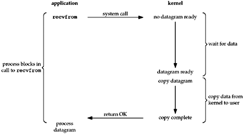
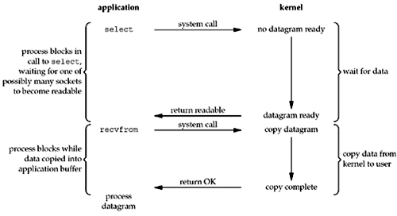
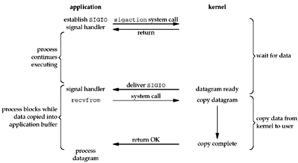
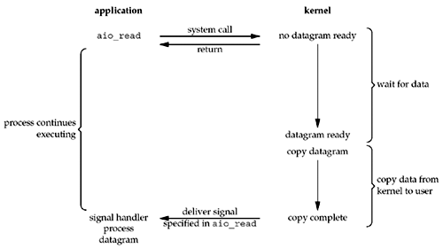

# I/O Models

- blocking I/O
- nonblocking I/O
- I/O multiplexing (`select` and `poll`)
- signal driven I/O (`SIGIO`)
- asynchronous I/O (the POSIX `aio_`functions)

## Blocking I/O Model

By default, all sockets are blocking. Using a datagram socket for our examples:



We use UDP for this example instead of TCP because with UDP, the concept of data being "ready" to read is simple: either an entire datagram has been received or it has not.

The process calls `recvfrom` and the system call does not return until the datagram arrives and is copied into our application buffer, or an error occurs. The most common error is the system call being interrupted by a signal. We say that our process is blocked the entire time from when it calls `recvfrom` until it returns. When `recvfrom` returns successfully, our application processes the datagram.

## Nonblocking I/O Model

When we set a socket to be nonblocking, we are telling the kernel "when an I/O operation that I request cannot be completed without putting the process to sleep, do not put the process to sleep, but return an error instead."



The first three times that we call `recvfrom`, there is no data to return, so the kernel immediately returns an error of `EWOULDBLOCK` instead. The fourth time we call `recvfrom`, a datagram is ready, it is copied into our application buffer, and `recvfrom` returns successfully. We then process the data.

When an application sits in a loop calling `recvfrom` on a nonblocking descriptor like this, it is called polling. The application is continually polling the kernel to see if some operation is ready. This is often a waste of CPU time, but this model is occasionally encountered, normally on systems dedicated to one function.

> 1. NIO与BIO的区别：
>
> 采用BIO形式的网络通信，如果需要实现服务端同时处理多个客户端线程，必然需要服务器端开启多线程与之对应，这样就会导致如果客户端请求过多，服务器线程开辟过多导致系统崩溃。
>
> 采用NIO形式的网络通信，进程轮询（重复）调用，消耗CPU的资源；适用并发量较小、且不需要及时响应的网络应用。
>
> 2. 阻塞与非阻塞：
>
> 阻塞和非阻塞关注的是**程序在等待调用结果（消息，返回值）时的状态**。
>
> 阻塞调用是指调用结果返回之前，当前线程会被挂起。调用线程只有在得到结果之后才会返回。
>
> 非阻塞调用指在不能立刻得到结果之前，该调用不会阻塞当前线程。
>
> 3. 同步与异步：
>
> 同步和异步关注的是**消息通信机制（synchronous communication/asynchronous communication）**。
>
> 所谓同步，就是在发出一个调用时，在没有得到结果之前，该调用就不返回。但是一旦调用返回，就得到返回值了。换句话说，就是**由调用者主动等待这个调用的结果。**
>
> 而异步则是相反，调用在发出之后，这个调用就直接返回了，所以没有返回结果。换句话说，**当一个异步过程调用发出后，调用者不会立刻得到结果。而是在调用发出后，被调用者通过状态、通知来通知调用者，或通过回调函数处理这个调用。**

## I/O Multiplexing Model

With I/O multiplexing, we call `select` or `poll` and block in one of these two system calls, instead of blocking in the actual I/O system call.


We block in a call to `select`, waiting for the datagram socket to be readable. When `select` returns that the socket is readable, we then call `recvfrom` to copy the datagram into our application buffer.

Comparing **Blocking I/O model** to **I/O Multiplexing Model**, there does not appear to be any advantage, and in fact, there is a slight disadvantage because using `select` requires two system calls instead of one. But the advantage in using `select` is that we can wait for more than one descriptor to be ready.

Another closely related I/O model is to use multithreading with blocking I/O. That model very closely resembles the model described above, except that instead of using `select` to block on multiple file descriptors, the program uses multiple threads (one per file descriptor), and each thread is then free to call blocking system calls like `recvfrom`.

> ### 为什么有IO多路复用机制
>
> IO多路复用是一种同步IO模型，实现一个线程可以监视多个文件句柄；一旦某个文件句柄就绪，就能够通知应用程序进行相应的读写操作；没有文件句柄就绪时会阻塞应用程序，交出CPU。**多路是指网络连接，复用指的是同一个线程。**
>
> 没有IO多路复用机制时，有BIO、NIO两种实现方式，但有一些问题。
>
> #### 同步阻塞（BIO）
>
> 服务端采用单线程，当`accept`一个请求后，在`recv`或`send`调用阻塞时，将无法`accept`其他请求（必须等上一个请求处`recv`或`send`完），无法处理并发：
>
> ```C
> // 伪代码描述
> while(1) {
>     // accept阻塞
>     client_fd = accept(listen_fd)
>     fds.append(client_fd)
>     for (fd in fds) {
>         // recv阻塞（会影响上面的accept）
>         if (recv(fd)) {
>             // logic
>         }
>     }  
> }
> ```
>
> 服务器端采用多线程，当`accept`一个请求后，开启线程进行`recv`，可以完成并发处理，但随着请求数增加需要增加系统线程，大量的线程占用很大的内存空间，并且线程切换会带来很大的开销，10000个线程真正发生读写事件的线程数不会超过20%，每次`accept`都开一个线程也是一种资源浪费：
>
> ```C
> // 伪代码描述
> while(1) {
>     // accept阻塞
>     client_fd = accept(listen_fd)
>     // 开启线程read数据（fd增多导致线程数增多）
>     new Thread func() {
>         // recv阻塞（多线程不影响上面的accept）
>         if (recv(fd)) {
>             // logic
>         }
>     }  
> }
> ```
>
> 这个模型最本质的问题在于，严重依赖于线程。但线程是很"贵"的资源，主要表现在：
>
> 1. 线程的创建和销毁成本很高。在Linux这样的操作系统中，线程本质上就是一个进程，创建和销毁都是重量级的系统函数。
> 2. 线程本身占用较大内存。如果系统中的线程数过千，线程栈累加之后的分配量巨大。
> 3. 线程的切换成本是很高的。操作系统发生线程切换的时候，需要保留线程的上下文，然后执行系统调用；如果线程数过高，可能执行线程切换的时间甚至会大于线程执行的时间，这时候带来的表现往往是系统load偏高、CPU sys使用率特别高（超过20%以上)，导致系统几乎陷入不可用的状态。
> 4. 容易造成锯齿状的系统负载。因为系统负载是用活动线程数或CPU核心数，一旦线程数量高但外部网络环境不是很稳定，就很容易造成大量请求的结果同时返回，激活大量阻塞线程从而使系统负载压力过大。
>
> 所以，当面对十万甚至百万级连接的时候，传统的BIO模型是无能为力的。随着移动端应用的兴起和各种网络游戏的盛行，百万级长连接日趋普遍，此时，必然需要一种更高效的I/O处理模型。
>
> #### 同步非阻塞（NIO）
>
> 服务器端当`accept`一个请求后，加入`fds`集合，每次轮询一遍`fds`集合`recv`（非阻塞）数据，没有数据则立即返回错误，每次轮询所有`fd`（包括没有发生读写事件的`fd`）会很浪费CPU：
>
> ```C
> setNonblocking(listen_fd)
> // 伪代码描述
> while(1) {
>     // accept非阻塞（cpu一直忙轮询）
>     client_fd = accept(listen_fd)
>     if (client_fd != null) {
>         // 有人连接
>         fds.append(client_fd)
>     } else {
>         // 无人连接
>     }  
>     for (fd in fds) {
>         // recv非阻塞
>         setNonblocking(client_fd)
>         // recv 为非阻塞命令
>         if (len = recv(fd) && len > 0) {
>             // 有读写数据
>             // logic
>         } else {
>             无读写数据
>         }
>     }  
> }
> ```
>
> 所有的系统I/O都分为两个阶段：等待就绪和操作。举例来说，读函数，分为等待系统可读和真正的读；同理，写函数分为等待网卡可以写和真正的写。等待就绪的阻塞是不使用CPU的，是在“空等”；而真正的读写操作的阻塞是使用CPU的，真正在"干活"，而且这个过程非常快，属于`memory copy`，带宽通常在1GB/s级别以上，可以理解为基本不耗时。
>
> BIO里用户最关心“我要读”，NIO里用户最关心"我可以读了"；NIO一个重要的特点是：socket主要的读、写、注册和接收函数，在等待就绪阶段都是非阻塞的，真正的I/O操作是同步阻塞的（消耗CPU但性能非常高）。
>
> Non-Blocking也可以实现类似select的功能，不过那是应用层去做select的功能，也就是应用层需要轮询描述符是否就绪，假如没有就绪，对`fd`的`read`会直接返回一个`errno`，代表没有数据可读等。轮询的缺点是浪费了太多CPU时间，因为`read`是要发系统调用的，进程会从应用态切换到内核态，每次这个切换过程都是资源的一种浪费。

## Signal-Driven I/O Model

We can also use signals, telling the kernel to notify us with the `SIGIO` signal when the descriptor is ready.



We first enable the socket for signal-driven I/O and install a signal handler using the `sigaction` system call. The return from this system call is immediate and our process continues; it is not blocked. When the datagram is ready to be read, the `SIGIO` signal is generated for our process. We can either read the datagram from the signal handler by calling `recvfrom` and then notify the main loop that the data is ready to be processed, or we can notify the main loop and let it read the datagram.

Regardless of how we handle the signal, the advantage to this model is that we are not blocked while waiting for the datagram to arrive. The main loop can continue executing and just wait to be notified by the signal handler that either the data is ready to process or the datagram is ready to be read.

> 相比于非阻塞式I/O的轮询方式，信号驱动I/O的CPU利用率更高。
>
> 异步I/O模型与信号驱动模型的主要区别在于：信号驱动I/O是由内核通知应用程序何时启动一个I/O操作，而异步I/O模型是由内核通知应用程序I/O操作何时完成。

## Asynchronous I/O Model

Asynchronous I/O is defined by the POSIX specification, and various differences in the realtime functions that appeared in the various standards which came together to form the current POSIX specification have been reconciled. In general, these functions work by telling the kernel to start the operation and to notify us when the entire operation (including the copy of the data from the kernel to our buffer) is complete.



We call `aio_read` (the POSIX asynchronous I/O functions begin with `aio_` or `lio_`) and pass the kernel the descriptor, buffer pointer, buffer size (the same three arguments for `read`), file offset (similar to `lseek`), and how to notify us when the entire operation is complete. This system call returns immediately and our process is not blocked while waiting for the I/O to complete. We assume in this example that we ask the kernel to generate some signal when the operation is complete. This signal is not generated until the data has been copied into our application buffer, which is different from the signal-driven I/O model.

> 与信号驱动IO的比较：信号驱动IO是由内核通知应用进程核实可以启动一个I/O操作，而异步IO是内核通知我们IO操作何时完成。
>
> AIO相比于NIO的优点：AIO把“内核拷贝数据到应用程序” 这个阶段的时间也变成了不阻塞，释放了CPU。

## Comparison of the I/O Models


This is a comparison of the five different I/O models. It shows that the main difference between the first four models is the first phase, as the second phase in the first four models is the same: the process is blocked in a call to `recvfrom` while the data is copied from the kernel to the caller's buffer. Asynchronous I/O, however, handles both phases and is different from the first four.

> ### Synchronous I/O versus Asynchronous I/O
>
> POSIX defines these two terms as follows:
>
> - A *synchronous I/O operation* causes the requesting process to be blocked until that I/O operation completes.
> - An *asynchronous I/O operation* does not cause the requesting process to be blocked.
>
> Using these definitions, the first four I/O models—blocking, nonblocking, I/O multiplexing, and signal-driven I/O—are all synchronous because the actual I/O operation (`recvfrom`) blocks the process. Only the asynchronous I/O model matches the asynchronous I/O definition.

